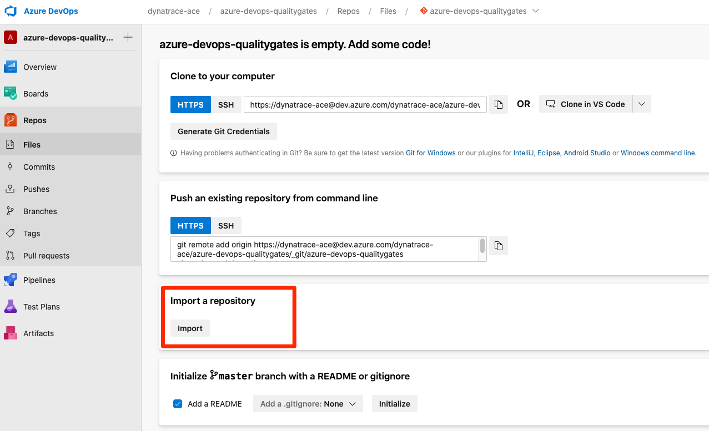
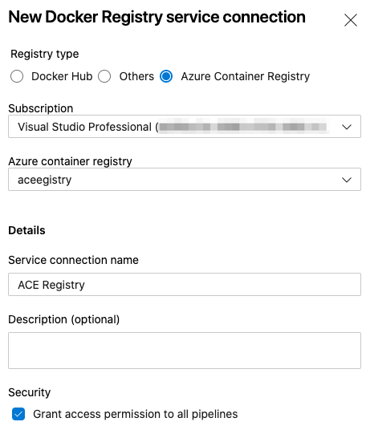

# demo-qualitygate-azuredevops
This repository contains information to demo quality gates on azure devops


## Set Up Azure environment

1. Fork this repository
2. Create AKS (Azure Kubernetes Service) cluster with ACR (Azure Container Registry) integration. Check out https://docs.microsoft.com/en-us/azure/aks/cluster-container-registry-integration for more details
3. Create a new project inside Azure Devops (https://dev.azure.com/)
4. Import the forked repository 
5. Once the import has been completed, go to `Project Settings` (bottom-left side of the screen)
6. Navigate to `Service connections` and add the following. You can select the cluster and registry from your subscription created earlier
   * Kubernetes
   
   * Docker Registry
   
7. Connect to the kubernetes cluster (can be via Cloud Shell) and install the `ingress-nginx` Ingress controller (https://kubernetes.github.io/ingress-nginx/deploy/)
8. Get the external ip of the `ingress-nginx-controller`, e.g. using the command `kubectl -n ingress-nginx get svc ingress-nginx-controller`
9. Deploy the `OneAgent Operator` on the kubernetes cluster
10. Deploy Keptn Quality Gates on the kubernetes cluster (or elsewhere) and ensure it is exposed. Note the Keptn Endpoint, Keptn API token and Keptn Bridge URL
11. Open the `azure-pipelines.yml` file (this can be done in the Azure DevOps UI) and fill in the variables:
```
variables:
- name: KEPTN_ENDPOINT
  value: 'https://xxx.nip.io/api'
- name: KEPTN_BRIDGE
  value: 'https://xxx.nip.io/bridge'
- name: KEPTN_API_TOKEN
  value: xxx
- name: KEPTN_PROJECT # can be chosen freely
  value: 'simplenode-azure'
- name: KEPTN_SERVICE # can be chosen freely
  value: 'simplenodeservice'
- name: KEPTN_STAGE # can be chosen freely
  value: 'staging'
- name: KEPTN_MONITORING
  value: 'dynatrace'
- name: SIMPLENODE_VERSION
  value: '1'
- name: APP_NAME
  value: 'simplenodeservice'
- name: INGRESS_ENDPOINT # this is the ingress for the simplenode application
  value: 'xxx.xxx.xxx.xxx.nip.io'
- name: REGISTRY_NAME
  value: 'ACE Registry' # as configured in the service connection in step 6
- name: AKS_NAME # as configured in the service connection in step 6
  value: 'AKS'
```